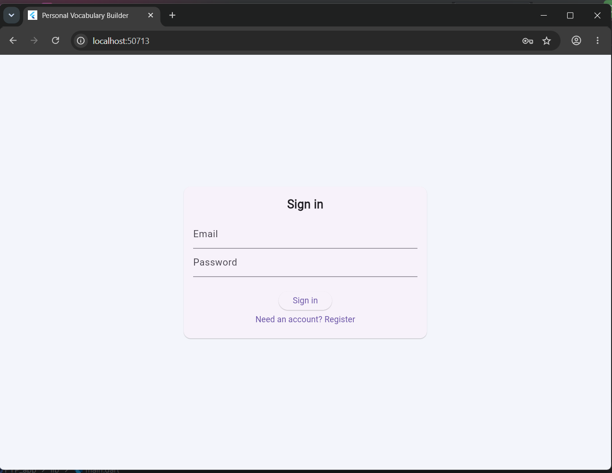
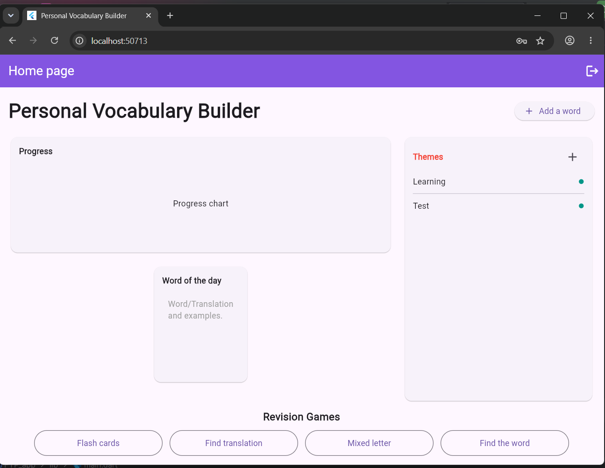
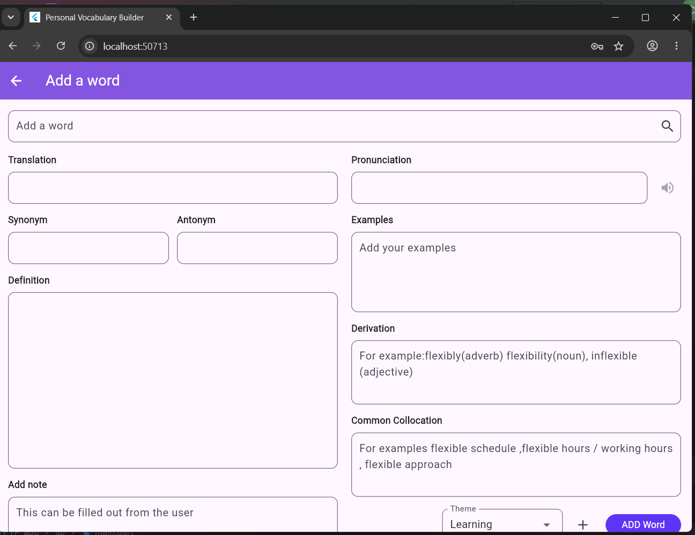
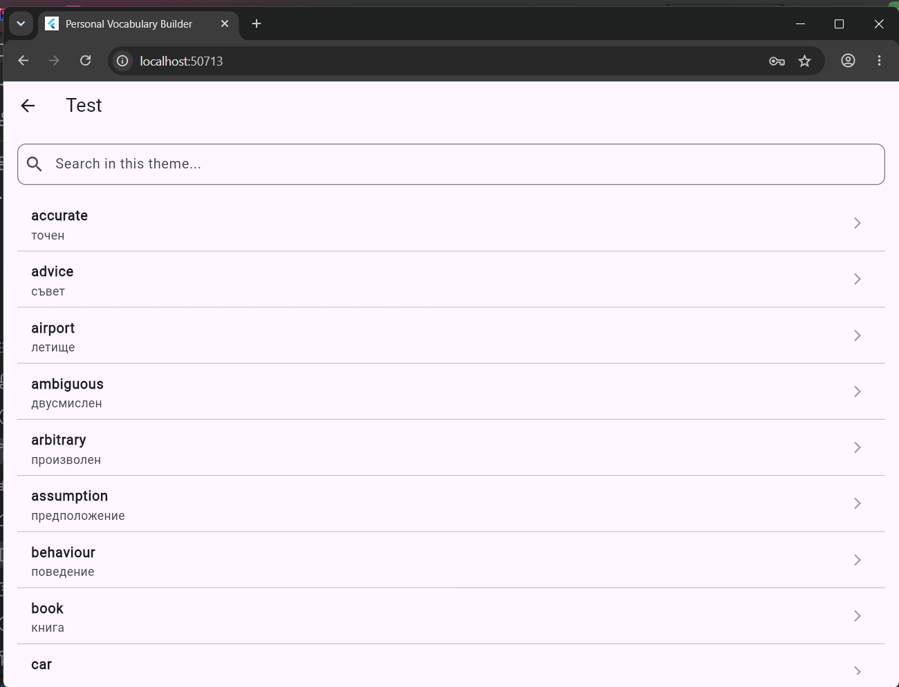
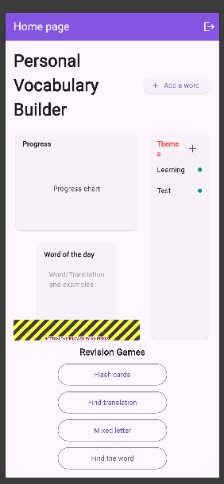
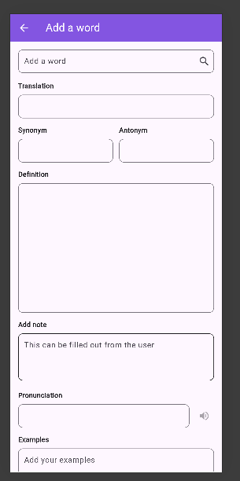
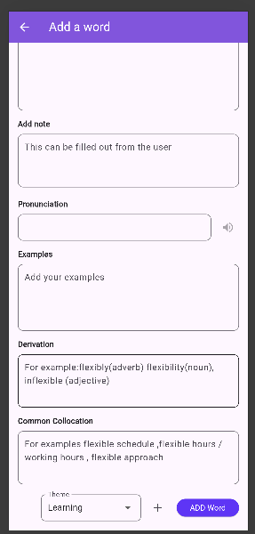
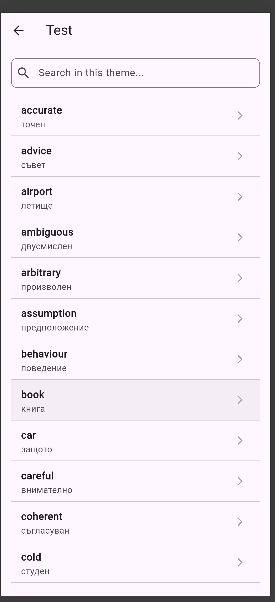

# Eng-Project-Personal-Vocabulary-Builder

# Personal Vocabulary Builder

A cross-platform vocabulary learning prototype developed as a final-year BSc (Hons) Computing Engineering Project at the University of Portsmouth.

## Overview

Personal Vocabulary Builder is a web-accessible application designed to help English language learners save unfamiliar words, organise them by theme, and review them later with supporting vocabulary information.

The project was created for learners who want to build vocabulary from their own academic, professional, or everyday contexts rather than relying only on predefined word lists.

## Academic Outcome

Final Year Engineering Project mark: **72% – First Class**

Academic feedback highlighted the project’s research grounding, methodology and planning, working prototype, architecture decisions, and honest evaluation.

Improvement areas identified:

- broader automated unit testing
- larger usability testing sample
- improved mobile responsiveness
- more reliable translation handling for isolated words
- further development of revision features

## Key Features

- User authentication with Firebase Authentication
- Word lookup using an external dictionary API
- English-to-Bulgarian translation support through a Firebase Cloud Function
- Secure handling of the translation API key by routing requests through the backend
- Save vocabulary records to Cloud Firestore
- Organise saved words by theme
- View saved words and word details
- Web-first design with partial mobile responsiveness

## Tech Stack

| Area | Technology |
|---|---|
| Frontend | Flutter / Dart |
| Backend services | Firebase |
| Authentication | Firebase Authentication |
| Database | Cloud Firestore |
| Serverless function | Firebase Cloud Functions |
| APIs | Dictionary API, DeepL API |
| Testing | Manual functional testing, unit testing, usability testing, mobile responsiveness testing, translation correctness testing |

## Project Context

This was an academic Engineering Project. The work included:

- literature review into vocabulary learning and retention
- analysis of existing vocabulary-learning applications
- user requirements gathering through a survey
- MoSCoW requirements prioritisation
- UI and architecture design
- implementation of a working prototype
- technical and usability testing
- evaluation against the original project requirements

## Testing and Evaluation

The prototype was tested using several methods.

### Manual Functional Testing

Core user flows tested:

- user registration and login
- searching for a word
- displaying dictionary results
- translating a word
- saving a word to Firestore
- assigning a word to a theme
- browsing saved words
- opening word details

### Unit Testing

Selected validation logic was tested, including word input validation.

### Usability Testing

Usability testing was conducted with participants completing typical tasks such as adding a word, assigning it to a theme, and finding saved vocabulary.

Participant data and raw research material are not included in this public repository.

### Mobile Responsiveness Testing

The app was checked using mobile view and real device/browser testing. Some layout issues were identified.

### Known Issues Found

- translation can be unreliable for isolated words
- mobile layout is only partially responsive
- automated test coverage is limited
- revision features are basic and need further development

## Screenshots

### Login Page

### Home Page

### Add Word Page

### Word Detail Page

### Mobile Layout Test – Home Page

### Mobile Layout Test – Add Word Page

### Mobile Layout Test – Word Details

## Repository Notice

This repository is intended as a portfolio version of an academic project. Personal data, participant data, raw research responses, API keys, and private university assessment documents are not included.
